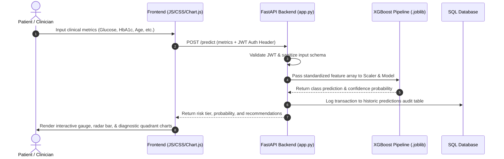

# Diabetes Risk Predictor

An advanced, AI-powered web application designed to predict the risk of diabetes based on clinical parameters. The system utilizes machine learning models to provide high-accuracy risk assessments and personalized lifestyle recommendations.

**Demo**: [https://diebeties-risk-predictor-deployment.vercel.app/](https://diebeties-risk-predictor-deployment.vercel.app/)

## 🚀 Features

- **AI Risk Assessment**: Uses a trained machine learning model (XGBoost) to evaluate diabetes risk.
- **Clinical Analytics Dashboard**: A dedicated dashboard featuring clinical-grade visualisations (Grouped Bar, Horizontal Bar, 2D Diagnostic Scatter, Line, and Doughnut Gauges) built with Chart.js to explain risk factors comprehensively.
- **Premium UI**: Modern, glassmorphism-inspired "bento grid" design with support for both Light and Dark modes.
- **Secure Login Interface**: JWT-token authenticated access for patient profile isolation.
- **Dynamic Recommendations**: Provides tailored lifestyle advice based on predicted risk levels.
- **FastAPI Backend**: High-performance asynchronous API for seamless inference.
- **Responsive Layout**: Optimized for both desktop and mobile viewing with zero layout shift.

## 🔄 Project Workflow


## 🛠️ Technology Stack

- **Frontend**: Vanilla JavaScript, HTML5, CSS3 (Backdrop blur filters & Mesh backgrounds), Chart.js (Data Visualizations).
- **Backend**: FastAPI (Python), SQLAlchemy ORM (SQLite/PostgreSQL database interface).
- **Machine Learning**: Scikit-learn, XGBoost, Joblib for model persistence.
- **Data**: Analysis based on the Pima Indians Diabetes Dataset.

## ⚙️ Setup & Installation

1. **Create Virtual Environment**:
   First, create a `.venv` directory for your project:
   ```powershell
   python -m venv .venv
   ```

2. **Install Dependencies**:
   You can install the dependencies directly using the environment's pip:
   ```powershell
   .\.venv\Scripts\pip install -r backend/requirements.txt
   ```

3. **Run the Project**:
   From the project root directory, start the server:
   ```powershell
   .\.venv\Scripts\python -m uvicorn app:app --reload
   ```

This will start the backend server at `http://localhost:8000` and automatically serve the frontend.

## 🧠 Model & Clinical Parameters
The analysis leverages both ML probabilities and strict clinical thresholds (ADA/WHO guidelines) across **10 clinical features**:
- Pregnancies
- Fasting Glucose Level (mg/dL)
- Blood Pressure (mmHg)
- Skin Thickness (mm)
- Insulin Level (IU/mL)
- BMI
- Diabetes Pedigree Function
- Age: Measured in years.
- **HbA1c Level (%)**: A measure of average blood sugar over the past 3 months (ADA standard).
- **BMI Category**: Clinically derived category (Underweight, Normal, Overweight, Obese).

## 📊 Dataset & Model Retraining

The project includes the original dataset and a Jupyter Notebook to allow you to easily retrain the machine learning model.

### 1. 📂 The Dataset
The dataset is tracked in this repository and is located at:
* **[pima_with_hba1c.csv](file:///d:/Projects/diebeties_Risk_Predictor_Deployment/pima_with_hba1c.csv)** (at the root of the project)

It contains **768 samples** with 10 clinical features (including HbA1c and BMI Category) used to train the classifier.

### 2. 🧠 Retraining via Jupyter Notebook (`VI_Project_model_2.ipynb`)
To retrain the model and regenerate the serialized prediction pipeline, you can run the provided notebook **[VI_Project_model_2.ipynb](file:///d:/Projects/diebeties_Risk_Predictor_Deployment/VI_Project_model_2.ipynb)** using one of the following methods:

#### Method A: Using VS Code (Recommended)
1. Install the **Jupyter** extension in VS Code.
2. Open **[VI_Project_model_2.ipynb](file:///d:/Projects/diebeties_Risk_Predictor_Deployment/VI_Project_model_2.ipynb)**.
3. Select your local `.venv` environment (with installed requirements) as the active kernel in the top-right corner.
4. Click **Run All** to execute the notebook.

#### Method B: Using Jupyter Notebook in Browser
1. Install Jupyter in your virtual environment:
   ```powershell
   .\.venv\Scripts\pip install jupyter
   ```
2. Launch the Jupyter Notebook server:
   ```powershell
   .\.venv\Scripts\jupyter notebook
   ```
3. Your browser will open showing the directory. Click on **[VI_Project_model_2.ipynb](file:///d:/Projects/diebeties_Risk_Predictor_Deployment/VI_Project_model_2.ipynb)**.
4. Go to **Cell > Run All** in the menu to execute the training process.

### 3. 🤖 Model Export & Usage
When you run the notebook:
* It reads the local **[pima_with_hba1c.csv](file:///d:/Projects/diebeties_Risk_Predictor_Deployment/pima_with_hba1c.csv)** dataset.
* It trains the **XGBoost Classifier** model and fits a standard scaler.
* It automatically serializes the trained artifacts (`model.joblib` and `scaler.joblib`) directly into the **`backend/models/`** directory.
* On startup, the FastAPI application loads these `.joblib` files to serve inference requests instantly.

*(Note: Staged and trained `.joblib` models are already tracked in the repository, so the backend is functional out-of-the-box.)*

---
*Created for advanced health diagnostics and visual analytics.*

